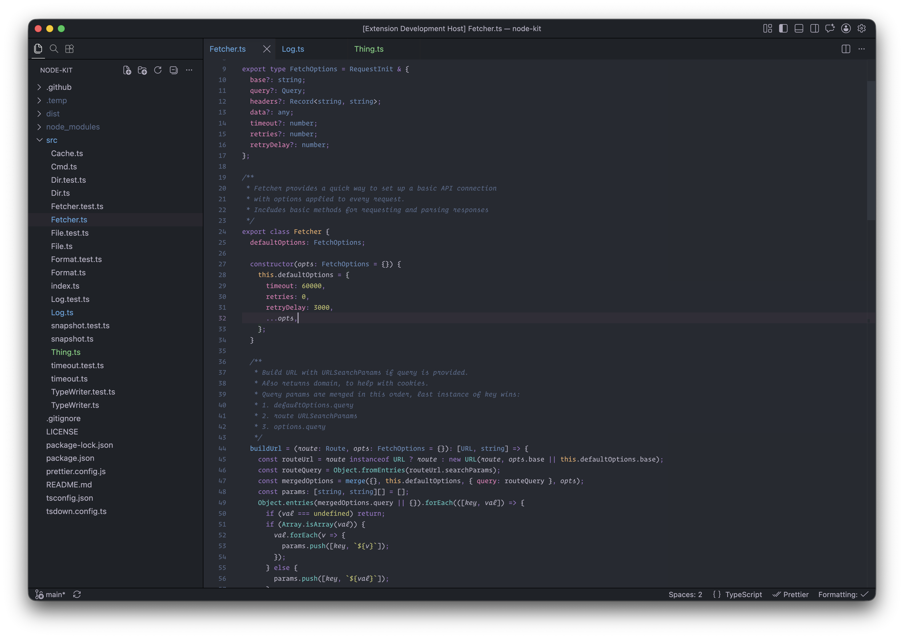

# Work Shirt

A dependable, well-worn color theme built around semantic syntax highlighting, a limited palette, and a minimalist workbench.



# Development

Install dependencies

```shell
pnpm install
```

Rebuild theme on file changes

```shell
pnpm dev
```

Use VS Code's `Run and Debug` to launch a new window using the theme and it'll update on file change.

## Release

(I always forget)

```
pnpm version [patch|minor|major]
```

- creates a new commit with version tag
- Pushes tag to github (`postversion` script in `package.json`)
- Triggers github workflow that publishes to VS Code Marketplace (`.github/workfows/publish.yml`)
